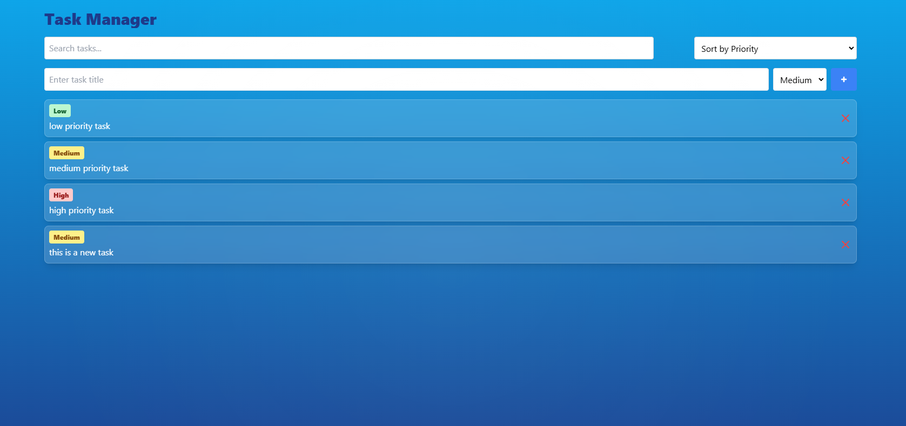
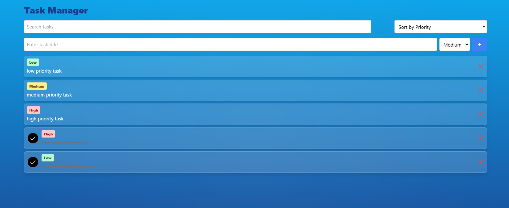
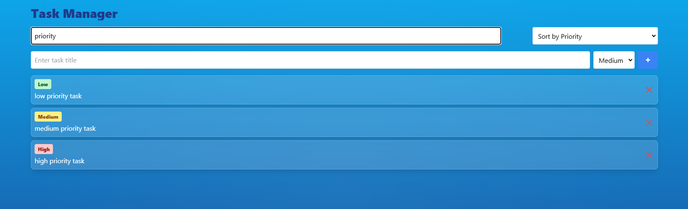

# Task Manager Application

This is a **Task Manager Application** built with React, JavaScript, and Tailwind CSS. It helps users manage tasks efficiently by allowing them to add, delete, and mark tasks as complete. Users can also prioritize and sort tasks, and utilize a search feature to locate specific tasks. Each task is stored in local storage, ensuring persistence after page reloads.

## Features

- **Task Input**: Add tasks with a title and priority level.
- **Task Deletion**: Delete tasks using a delete button.
- **Task Completion**: Mark tasks as completed, showing a checkmark animation.
- **Task Persistence**: Tasks are saved in local storage to remain after page reloads.
- **Task Search**: Filter tasks by keywords to quickly locate specific items.
- **Priority Setting & Sorting**: Assign priority levels to tasks and sort them by priority.
- **Glassmorphic UI with Sun Ray Effect**: The UI includes a glassmorphic effect and an oceanic background with sun rays for a visually appealing interface.

## Screenshots





## Setup and Launch Process

1. **Clone the Repository**
   ```bash
   git clone https://github.com/AnkurOtaku/Task-Management
   cd task-manager
2. **Install Dependencies**
   ```bash
   npm install
2. **Run the Application**
   ```bash
   npm run start

**The application will start on http://localhost:3000. Open this URL in your browser to use the Task Manager.**


## Assumptions Made During Development

1. **Task Priority**: Priority levels are predefined (e.g., low, medium, high) and are indicated by a color-coded badge for easy identification.
2. **Task Storage**: Tasks are stored in the browser's local storage to maintain persistence. This version does not include a backend server for task storage.
3. **Completion Marking Animation**: A checkmark SVG animation appears when a task is marked as complete to enhance the user experience.
4. **Screen Responsiveness**: Tailwind CSS is used for responsive design, though very small screens may require additional optimization.
5. **Browser Compatibility**: The application is optimized for modern browsers and may experience compatibility issues on older versions of Internet Explorer or other non-standard browsers.